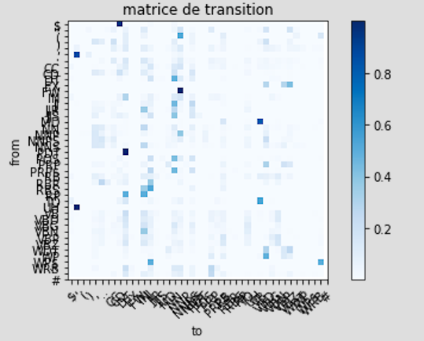
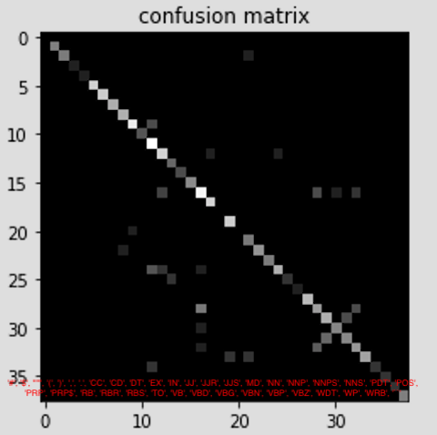

# POS tagging, analyse des phrases

Base utilisée : _Wapiti_.

## Approche à base de dictionnaire

Comparaison de différents score en fonction de préprocessing sur une classification à base de dictionnaire

- sans preprocessing : 75.58%
- avec lowering :      74.73%
- avec casse - les s : 70.99%
- lower - s :          69.46%
- avec un vote sur la classe majoritaire : ___76.74%___

Baseline _naïve_ simple à mettre en oeuvre et apprentissage rapide.

## Méthodes séquentielles

### HMM

Prend en compte l'ordre d'apparition des mots.

- sans preprocessing : 81.01%
- ajout du tag : <EOS>   --> 81.22%
- ajout du lowering      --> ___81.43%___ (avec le EOS)
- renversage ordre phrase + <EOS> + lowering --> 81.43% (no improvment)

### TreeTagger

Outil du marché, n'utilisant pas les même tags, résultats non comparables.

